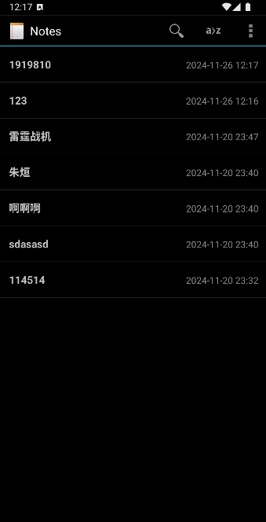
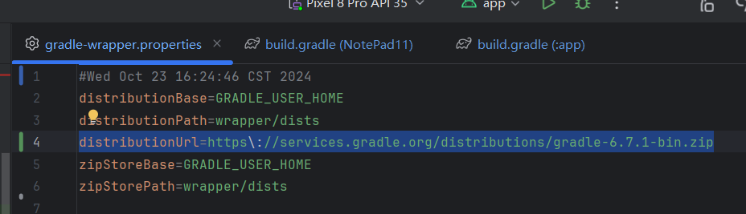
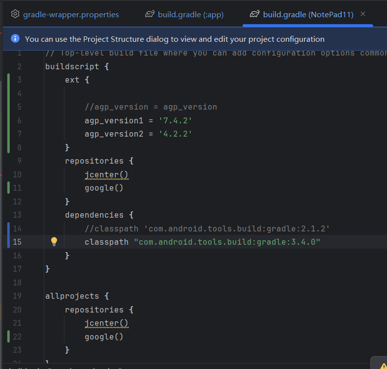
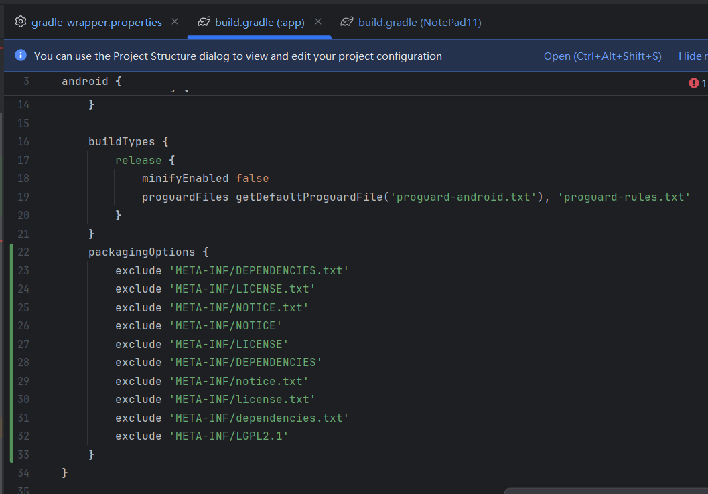
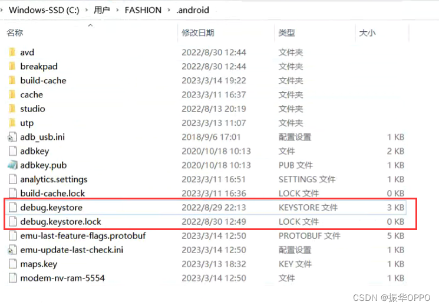

# NotePad 项目

## 项目简介

这个项目是一个简单的笔记应用，支持笔记管理、搜索和排序功能。用户可以在主页上按标题或最后修改时间对笔记进行排序，并在笔记内部自定义背景颜色。每个笔记会显示最后修改的时间戳，方便用户查看修改记录。

## 功能特点

- **主页搜索**：用户可以通过标题或内容搜索笔记。
  - 
- **排序功能**：
  - 按照最后修改时间排序。
  - 按照笔记标题排序，支持传统排序方式（包括字母、汉字、数字和标点符号的排序）。

- **笔记编辑**：在笔记编辑页面，可以设置笔记的背景颜色。
- **时间戳显示**：每个笔记会显示最后修改的时间戳。

## 安装与使用

1. 将项目克隆到本地：
    ```bash
    git clone https://github.com/amsatorian/Android_SemiExpt.git
    ```

2. 导入 Android Studio 并构建项目。

3. 运行应用程序并开始使用。

## 配置详情

### 1. `使用JDK9的版本`

### 2. `gradle-wrapper.properties`

请使用以下配置的 `distributionUrl`：



```properties
distributionUrl=https\://services.gradle.org/distributions/gradle-6.7.1-bin.zip
```

### 3.  `build.gradle(notepad)`
classpath请使用3.4.0:



```properties
classpath="com.android.tools.build:gradle:3.4.0"
```
### 4. `build成功之后`
#### 4.1 `Error:Execution failed for task ':app:packageDebug'... 出现这个报错`
build.gradle（:app）中的 android{ ... } 中 添加：



```properties
packagingOptions {
    exclude 'META-INF/DEPENDENCIES.txt'
    exclude 'META-INF/LICENSE.txt'
    exclude 'META-INF/NOTICE.txt'
    exclude 'META-INF/NOTICE'
    exclude 'META-INF/LICENSE'
    exclude 'META-INF/DEPENDENCIES'
    exclude 'META-INF/notice.txt'
    exclude 'META-INF/license.txt'
    exclude 'META-INF/dependencies.txt'
    exclude 'META-INF/LGPL2.1'
}
```
#### 4.2 `com.android.ide.common.signing.KeytoolException: Failed to read key AndroidDebugKey from store出现这个问题`
请删除以下两个文件并clean build之后rebuild（此文件的地址请看报错信息）:



## 贡献者

- **Amsatorian**：项目的唯一贡献者。

## 许可证

本项目采用 [MIT 许可证](LICENSE)。


