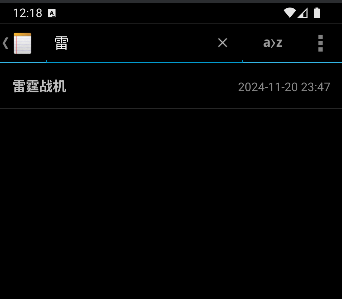
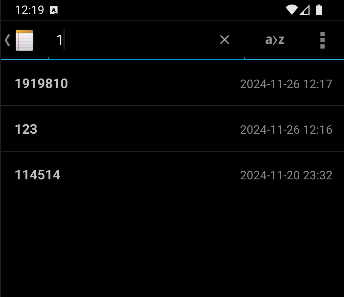
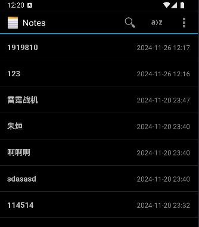
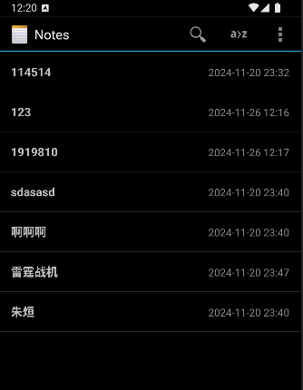
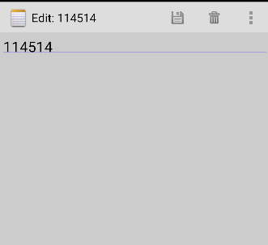
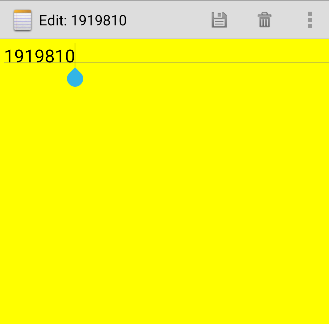

# NotePad 项目

## 项目简介

这个项目是一个基于NotePad应用基础上进行二次开发的简单的笔记应用，支持笔记管理、搜索和排序功能。用户可以在主页上按标题或最后修改时间对笔记进行排序，并在笔记内部自定义背景颜色。每个笔记会显示最后修改的时间戳，方便用户查看修改记录。

## 功能特点

### 基础功能：
#### 时间戳显示：每个笔记会显示最后修改的时间戳。


#### 主页搜索：用户可以通过笔记标题搜索笔记。
   

### 附加功能：
#### 排序功能：默认按照最后修改时间排序，点击排序按钮后按照笔记标题首字母排序（包括字母、汉字、数字和标点符号的排序）。
 

#### 更换背景：在笔记编辑页面，可以设置笔记的背景颜色。
    

## 项目主要结构

### Java类

#### NoteEditor.java:
笔记编辑页面的 Activity，负责笔记的编辑和保存功能<br>
#### NotePad.java:
主 Activity，负责展示笔记列表和其他功能，如排序、搜索等<br>
#### NotePadProvider.java:
提供数据库访问和内容提供者功能，用于与数据库交互<br>
#### NotesList.java:
笔记列表的 Activity，展示所有笔记的列表<br>
#### NotesLiveFolder.java:
处理与文件夹和笔记的动态管理功能<br>
#### TitleEditor.java:
负责编辑笔记标题的 Activity<br>

### Layout布局文件

#### note_editor.xml:
笔记编辑页面的布局文件，包含编辑框、按钮等<br>
#### noteslist_item.xml:
单个笔记项的布局文件，展示笔记标题和其他信息<br>
#### title_editor.xml:
标题编辑页面的布局文件，用于编辑笔记的标题<br>

## 实现过程

### 1.时间戳显示

#### 1.1 修改PROJECTION数组，添加时间戳字段COLUMN_NAME_MODIFICATION_DATE
```
 private static final String[] PROJECTION = new String[] {
            NotePad.Notes._ID, // 0
            NotePad.Notes.COLUMN_NAME_TITLE, // 1
            NotePad.Notes.COLUMN_NAME_MODIFICATION_DATE // 2
    };
```

## 贡献者

Amsatorian：项目的拓展功能贡献者。
