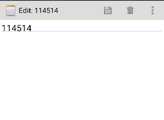

# NotePad 项目

## 项目简介

这个项目是一个基于NotePad应用基础上进行二次开发的简单的笔记应用，支持笔记管理、搜索和排序功能。用户可以在主页上按标题或最后修改时间对笔记进行排序，并在笔记内部自定义背景颜色。每个笔记会显示最后修改的时间戳，方便用户查看修改记录。

## 功能特点

### 基础功能：
#### 时间戳显示：每个笔记会显示最后修改的时间戳。


#### 主页搜索：用户可以通过笔记标题搜索笔记。
   

### 附加功能：
#### 排序功能：默认按照最后修改时间排序，点击排序按钮后按照笔记标题首字母排序（包括字母、汉字、数字和标点符号的排序）。
 

#### 更换背景颜色：在笔记编辑页面，可以设置笔记的背景颜色。
    

## 项目主要结构

### Java类

#### NoteEditor.java:
笔记编辑页面的 Activity，负责笔记的编辑和保存功能<br>
#### NotePad.java:
主 Activity，负责展示笔记列表和其他功能，如排序、搜索等<br>
#### NotePadProvider.java:
提供数据库访问和内容提供者功能，用于与数据库交互<br>
#### NotesList.java:
笔记列表的 Activity，展示所有笔记的列表<br>
#### NotesLiveFolder.java:
处理与文件夹和笔记的动态管理功能<br>
#### TitleEditor.java:
负责编辑笔记标题的 Activity<br>

### Layout布局文件

#### note_editor.xml:
笔记编辑页面的布局文件，包含编辑框、按钮等<br>
#### noteslist_item.xml:
单个笔记项的布局文件，展示笔记标题和其他信息<br>
#### title_editor.xml:
标题编辑页面的布局文件，用于编辑笔记的标题<br>

## 实现过程

### 1.时间戳显示

#### 1.1 在NotesList.java中修改PROJECTION数组，添加时间戳字段COLUMN_NAME_MODIFICATION_DATE
```
 private static final String[] PROJECTION = new String[] {
            NotePad.Notes._ID, // 0
            NotePad.Notes.COLUMN_NAME_TITLE, // 1
            NotePad.Notes.COLUMN_NAME_MODIFICATION_DATE // 2
    };
```

#### 1.2 修改对应的布局文件noteslist_item.xml，添加时间戳的文本框
在布局文件中新建一个TextView来显示时间戳
```
 <!-- 标题和修改日期布局 -->
    <LinearLayout
        android:layout_width="match_parent"
        android:layout_height="wrap_content"
        android:orientation="horizontal"
        android:padding="8dp">

        <!-- 标题文本（Title TextView） -->
        <TextView
            android:id="@android:id/text1"
            android:layout_width="0dp"
            android:layout_height="wrap_content"
            android:layout_weight="1"
            android:textSize="16sp"
            android:textStyle="bold" />

        <!-- 修改日期文本（Modification Date TextView） -->
        <TextView
            android:id="@android:id/text2"
            android:layout_width="wrap_content"
            android:layout_height="wrap_content"
            android:textSize="14sp"
            android:textColor="#888888" />
    </LinearLayout>
```

#### 1.3 在NotesList.java中修改适配器，设置时间戳并格式化时间戳
将时间戳绑定到TextView上，变更将其格式化为可供用户读取的显示格式
```
 // The names of the cursor columns to display in the view, initialized to the title column
        String[] dataColumns = {
                NotePad.Notes.COLUMN_NAME_TITLE,
                NotePad.Notes.COLUMN_NAME_MODIFICATION_DATE
        };

        // The view IDs that will display the cursor columns, initialized to the TextView in
        // noteslist_item.xml
        int[] viewIDs = {
                android.R.id.text1,
                android.R.id.text2
        };

        // Creates the backing adapter for the ListView.
        SimpleCursorAdapter adapter = new SimpleCursorAdapter(
                this,
                R.layout.noteslist_item,
                cursor,
                dataColumns,
                viewIDs
        );

        adapter.setViewBinder(new SimpleCursorAdapter.ViewBinder() {
            @Override
            public boolean setViewValue(View view, Cursor cursor, int columnIndex) {
                if (columnIndex == cursor.getColumnIndex(NotePad.Notes.COLUMN_NAME_MODIFICATION_DATE)) {
                    // 获取时间戳
                    long timestamp = cursor.getLong(columnIndex);
                    // 格式化日期
                    String date = android.text.format.DateFormat.format("yyyy-MM-dd HH:mm", new java.util.Date(timestamp)).toString();
                    // 设置到 TextView
                    ((TextView) view).setText(date);
                    return true;
                }
                return false;
            }
        });

        // Sets the ListView's adapter to be the cursor adapter that was just created.
        setListAdapter(adapter);
```

#### 1.4 在NotePadProvider.java中修改更新数据库的语句
```
public void onCreate(SQLiteDatabase db) {
           db.execSQL("CREATE TABLE " + NotePad.Notes.TABLE_NAME + " ("
                   + NotePad.Notes._ID + " INTEGER PRIMARY KEY,"
                   + NotePad.Notes.COLUMN_NAME_TITLE + " TEXT,"
                   + NotePad.Notes.COLUMN_NAME_NOTE + " TEXT,"
                   + NotePad.Notes.COLUMN_NAME_CREATE_DATE + " INTEGER,"
                   + NotePad.Notes.COLUMN_NAME_MODIFICATION_DATE + " INTEGER"
                   + ");");
       }
```

### 2.根据笔记标题查询功能

#### 2.1 在菜单文件list_options_menu.xml中修改菜单的样式，添加搜索按钮
```
<?xml version="1.0" encoding="utf-8"?>
<menu xmlns:tools="http://schemas.android.com/tools"
    xmlns:android="http://schemas.android.com/apk/res/android">

    <!-- 添加新笔记的按钮 -->
    <item
        android:id="@+id/menu_add"
        android:icon="@drawable/ic_menu_compose"
        android:title="@string/menu_add"
        android:alphabeticShortcut="a"
        android:showAsAction="ifRoom" />

    <!-- 搜索按钮 -->
    <item
        android:id="@+id/menu_search"
        android:icon="@android:drawable/ic_menu_search"
        android:title="搜索"
        android:showAsAction="always|collapseActionView"
        android:actionViewClass="android.widget.SearchView"
        tools:ignore="HardcodedText" />

    <!-- 粘贴的按钮 -->
    <item
        android:id="@+id/menu_paste"
        android:icon="@drawable/ic_menu_compose"
        android:title="@string/menu_paste"
        android:alphabeticShortcut="p" />
</menu>
```

#### 2.2 更新onOptionsItemSelected方法，处理按钮的事件
```
@Override
    public boolean onOptionsItemSelected(MenuItem item) {
        switch (item.getItemId()) {
            case R.id.menu_add:
                // 新建笔记
                startActivity(new Intent(Intent.ACTION_INSERT, getIntent().getData()));
                return true;

            case R.id.menu_paste:
                // 粘贴笔记
                startActivity(new Intent(Intent.ACTION_PASTE, getIntent().getData()));
                return true;

            case R.id.menu_search:
                // 点击搜索按钮（不需要特别处理，SearchView 会自动展开）
                return true;

            default:
                return super.onOptionsItemSelected(item);
        }
    }
```

#### 2.3 在NotesList.java中创建onCreateOptionsMenu的方法来显示主页上方的菜单
通过添加按钮来绑定SearchView，并为其设置事件监听器
实时搜索实现用户输入内容后系统自动更新搜索内容的功能
```
 @Override
    public boolean onCreateOptionsMenu(Menu menu) {
        // 从 XML 资源加载菜单
        MenuInflater inflater = getMenuInflater();
        inflater.inflate(R.menu.list_options_menu, menu);

        // 为菜单添加搜索按钮，绑定 SearchView
        MenuItem searchItem = menu.findItem(R.id.menu_search);
        SearchView searchView = (SearchView) searchItem.getActionView();
        searchView.setQueryHint("搜索笔记");

        // 设置搜索事件监听器
        searchView.setOnQueryTextListener(new SearchView.OnQueryTextListener() {
            @Override
            public boolean onQueryTextSubmit(String query) {
                // 用户提交搜索
                searchNotes(query);
                return true;
            }

            @Override
            public boolean onQueryTextChange(String newText) {
                // 实时搜索
                searchNotes(newText);
                return true;
            }
        });

        // 添加额外的意图选项
        Intent intent = new Intent(null, getIntent().getData());
        intent.addCategory(Intent.CATEGORY_ALTERNATIVE);
        menu.addIntentOptions(Menu.CATEGORY_ALTERNATIVE, 0, 0,
                new ComponentName(this, NotesList.class), null, intent, 0, null);

        return super.onCreateOptionsMenu(menu);
    }
```

#### 2.4 实现searchNotes方法
实现对某个笔记标题的模糊搜索
```
 private void searchNotes(String query) {
        // 使用标题模糊查询数据库
        Cursor cursor = getContentResolver().query(
                NotePad.Notes.CONTENT_URI,
                null,
                NotePad.Notes.COLUMN_NAME_TITLE + " LIKE ?",
                new String[]{"%" + query + "%"},
                null
        );

        // 获取当前绑定的 SimpleCursorAdapter 并更新数据
        SimpleCursorAdapter adapter = (SimpleCursorAdapter) getListAdapter();
        adapter.changeCursor(cursor);
    }
```

### 3.排序功能

#### 3.1 在对应的布局文件中添加排序按钮
```
    <!-- 排序按钮 -->
    <item
        android:id="@+id/menu_sort"
        android:title="按标题排序"
        android:icon="@android:drawable/ic_menu_sort_alphabetically"
        android:showAsAction="always|collapseActionView"
        tools:ignore="HardcodedText" />

```

#### 3.2 更新onOptionsItemSelected方法，处理按钮的事件
```
 @Override
    public boolean onOptionsItemSelected(MenuItem item) {
        switch (item.getItemId()) {
            case R.id.menu_add:
                // 新建笔记
                startActivity(new Intent(Intent.ACTION_INSERT, getIntent().getData()));
                return true;

            case R.id.menu_paste:
                // 粘贴笔记
                startActivity(new Intent(Intent.ACTION_PASTE, getIntent().getData()));
                return true;

            case R.id.menu_search:
                // 点击搜索按钮（不需要特别处理，SearchView 会自动展开）
                return true;

            case R.id.menu_sort:
                cycleSortOrder();
                return true;

            default:
                return super.onOptionsItemSelected(item);
        }
    }
```

#### 3.3 排序功能的逻辑实现
分为SORT_DEFAULT默认的按照最后修改事件来排序和SORT_BY_TRADITIONAL_TITLE按照笔记标题来排序

实现cycleSortOrder方法，通过正则表达式完成对笔记标题的排序实现
```
 private void cycleSortOrder() {
        switch (currentSortState) {
            case SORT_DEFAULT:
                // 切换到按传统标题排序
                currentSortState = SORT_BY_TRADITIONAL_TITLE;
                updateNotesList(
                        "CASE " +
                                "WHEN " + NotePad.Notes.COLUMN_NAME_TITLE + " GLOB '[0-9]*' THEN 1 " + // 数字或标点符号
                                "WHEN " + NotePad.Notes.COLUMN_NAME_TITLE + " GLOB '[A-Za-z]*' THEN 2 " + // 字母
                                "ELSE 3 END, " +
                                NotePad.Notes.COLUMN_NAME_TITLE + " COLLATE LOCALIZED ASC"
                );
                break;

            case SORT_BY_TRADITIONAL_TITLE:
                // 切换回默认排序
                currentSortState = SORT_DEFAULT;
                updateNotesList(NotePad.Notes.DEFAULT_SORT_ORDER);
                break;
        }
    }
```

实现updateNotesList方法，更新笔记列表，通过更新Cursor来完成对笔记列表的排序
```
 private void updateNotesList(String sortOrder) {
        Cursor cursor = getContentResolver().query(
                NotePad.Notes.CONTENT_URI,
                PROJECTION,
                null, // 无需 where 条件
                null, // 无需 where 参数
                sortOrder // 动态排序
        );
```

### 4.更换背景颜色

#### 4.1 修改笔记中的菜单文件，增加更改颜色的选项
```
<?xml version="1.0" encoding="utf-8"?>
<menu xmlns:android="http://schemas.android.com/apk/res/android">
    <item android:id="@+id/menu_save"
        android:icon="@drawable/ic_menu_save"
        android:alphabeticShortcut="s"
        android:title="@string/menu_save"
        android:showAsAction="ifRoom|withText" />
    <item android:id="@+id/menu_revert"
        android:icon="@drawable/ic_menu_revert"
        android:title="@string/menu_revert" />
    <item android:id="@+id/menu_delete"
        android:icon="@drawable/ic_menu_delete"
        android:title="@string/menu_delete"
        android:showAsAction="ifRoom|withText" />
    <item android:id="@+id/menu_change_color"
        android:icon="@android:drawable/ic_menu_manage"
        android:title="@string/menu_change_color"
        android:showAsAction="ifRoom|withText" />
</menu>
```

#### 4.2 在NoteEditor.java中，更新onCreate方法
新增以下代码以显示背景颜色
```
 int backgroundColor = loadBackgroundColor();
        findViewById(android.R.id.content).getRootView().setBackgroundColor(backgroundColor);
```

实现loadBackgroundColor方法,加载笔记背景颜色
```
 /**
     * 从 SharedPreferences 中加载背景颜色。
     * 如果未保存颜色，返回默认颜色（例如白色）。
     */
    private int loadBackgroundColor() {
        // 非静态方法，可以直接调用 getSharedPreferences
        SharedPreferences prefs = getSharedPreferences("NotePrefs", MODE_PRIVATE);
        return prefs.getInt("backgroundColor", Color.WHITE); // 默认背景颜色为白色
    }
```

#### 4.3 更新onOptionsItemSelected方法，处理修改背景颜色按钮的点击事件
```
@Override
    public boolean onOptionsItemSelected(MenuItem item) {
        // 根据用户选择的菜单项进行操作
        switch (item.getItemId()) {
            case R.id.menu_save:
                // 保存笔记
                String text = mText.getText().toString();
                updateNote(text, null);
                finish(); // 结束活动
                return true;

            case R.id.menu_delete:
                // 删除笔记
                deleteNote();
                finish(); // 结束活动
                return true;

            case R.id.menu_revert:
                // 取消编辑并恢复原始内容
                cancelNote();
                return true;

            case R.id.menu_change_color:
                // 更改背景颜色
                showColorPickerDialog();
                return true;

            default:
                return super.onOptionsItemSelected(item);
        }
```

#### 4.4 实现按钮点击后的的界面显示
实现showColorPickerDialog方法，提供系统自带的颜色给用户选择，并在用户选择后保存选项，通过saveBackgroundColor方法来保存颜色，以便下次打开NotePad使用
```
 private void showColorPickerDialog() {
        // 定义一些预设的背景颜色
        final int[] colors = {Color.WHITE, Color.YELLOW, Color.LTGRAY, Color.CYAN, Color.MAGENTA};

        // 创建一个颜色选择对话框
        AlertDialog.Builder builder = new AlertDialog.Builder(this);
        builder.setTitle("选择背景颜色");

        // 列出颜色选项
        builder.setItems(new String[]{"白色", "黄色", "浅灰色", "青色", "洋红色"}, new DialogInterface.OnClickListener() {
            @Override
            public void onClick(DialogInterface dialog, int which) {
                // 获取用户选择的颜色
                int selectedColor = colors[which];

                // 保存颜色到 SharedPreferences
                saveBackgroundColor(selectedColor);

                // 更新背景颜色
                findViewById(android.R.id.content).getRootView().setBackgroundColor(selectedColor);
            }
        });
```

#### 4.5 异步保存颜色信息
实现saveBackgroundColor方法
```
 private void saveBackgroundColor(int color) {
        SharedPreferences prefs = getSharedPreferences("NotePrefs", MODE_PRIVATE);
        SharedPreferences.Editor editor = prefs.edit();
        editor.putInt("backgroundColor", color);
        editor.apply(); // 异步保存
    }
```

## 贡献者

Amsatorian：项目的拓展功能贡献者。
